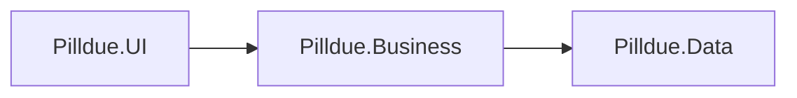

# Architecture

## Product intent

Pilldue helps you track medications and know when each one needs a refill. You log therapy schedules; the app surfaces refill timing.

**Audience:** personal tool only. One local instance per person; never multi-tenant or shared-user accounts. Household members each run their own copy if needed.

## v1 scope

### In

- Medication list with dosing schedule
- Current stock (pills left) and pack/refill quantity → **refill-by date**
- Log a refill (add / reset stock)
- Refill history
- **Flag a skipped / missed dose** → increase pills left by that dose (inventory correction, not a reminder)

### Out

- Pharmacy / Rx numbers / doctor fields
- Dose reminders / push / “time to take” prompts
- Multi-user, cloud hosting, sync accounts

## Stack

| Topic | Choice |
|-------|--------|
| Audience | Single-user, local instances only |
| Delivery | Local small published exe |
| UI | Spectre.Console |
| Persistence | SQLite via Data layer |
| .NET | .NET 10 (`net10.0`) |
| Solution | [Pilldue.slnx](../Pilldue.slnx) |

## Solution layout

```
Pilldue.slnx
src/
  Pilldue.Data/        # SQLite persistence
  Pilldue.Business/    # domain model + application services
  Pilldue.UI/          # Spectre.Console host / entry point (exe)
```

Dependency direction:



- **UI** depends on **Business** only (not on concrete storage details).
- **Business** defines what to store/load; **Data** implements it.
- A future UI can reference **Business** the same way without rewriting domain or persistence.

Projects are scaffolded empty (placeholders only). Domain design and feature implementation come next.

## Tests

```
tests/
  Pilldue.Data.Tests/           # unit: repositories, SQLite
  Pilldue.Business.Tests/       # unit: refill math, skip-dose, services
  Pilldue.IntegrationTests/     # scenarios: several actions → assert outcomes
```

Integration tests compose Business + Data without the TUI. UI is not covered by automated tests in v1 scaffold.
