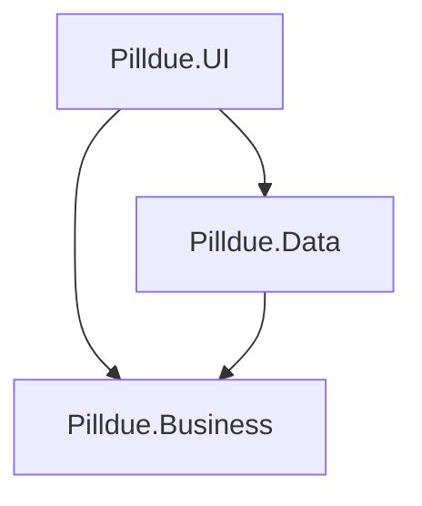

# Architecture

## Product intent

Pilldue helps you track medications against a **monthly refill day**, package-based stock, and prescription validity — so you know what to buy before the next (or second) refill and when to renew the prescription.

**Audience:** personal tool only. One local instance per person; never multi-tenant. See [use-cases.md](use-cases.md) for v1 flows.

## v1 scope

### In

- Config default refill **day of month** (5), per-med override
- Med definition: package size, prescribed package count, daily dosage, stock, prescription window (~6 months)
- Queries: stock vs next refill day; short list; need-extra-packages for second refill day
- Refill by package count; skip-dose stock bump; calendar (last covered + prescription end)

### Out

- Pharmacy / Rx numbers / doctor contacts
- Dose reminders / push
- Multi-user, cloud, sync accounts

## Stack

| Topic | Choice |
|-------|--------|
| Delivery | Local small published exe |
| UI | Spectre.Console |
| Persistence | SQLite |
| Config | File (default refill day) |
| .NET | .NET 10 (`net10.0`) |
| Solution | [Pilldue.slnx](../Pilldue.slnx) |

## Solution layout and dependencies

```
Pilldue.slnx
src/
  Pilldue.Business/    # domain, ports, pure logic, app services
  Pilldue.Data/        # SQLite + config file implementations of ports
  Pilldue.UI/          # Spectre.Console composition root
```

Target dependency direction (contracts / DIP — to be applied in the interfaces issue):



- Ports and entities live in **Business**
- **Data** implements ports (SQLite, config file)
- **UI** wires implementations and screens

Today’s scaffold still has `Business → Data` until the contracts PR flips it.

## Tests

```
tests/
  Pilldue.Data.Tests/
  Pilldue.Business.Tests/
  Pilldue.IntegrationTests/   # multi-step actions → assert; no UI
```

## Docs

- [Use cases](use-cases.md)
- [Getting started](getting-started.md)
- [Development](development.md)
